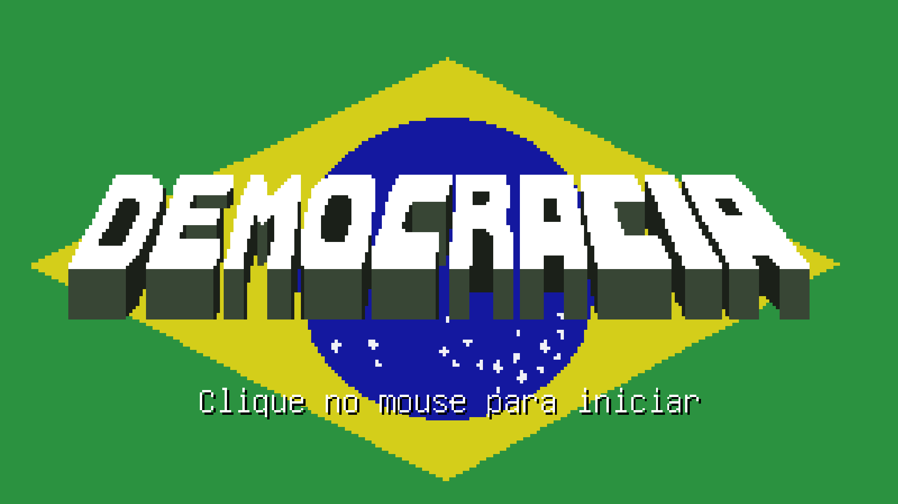
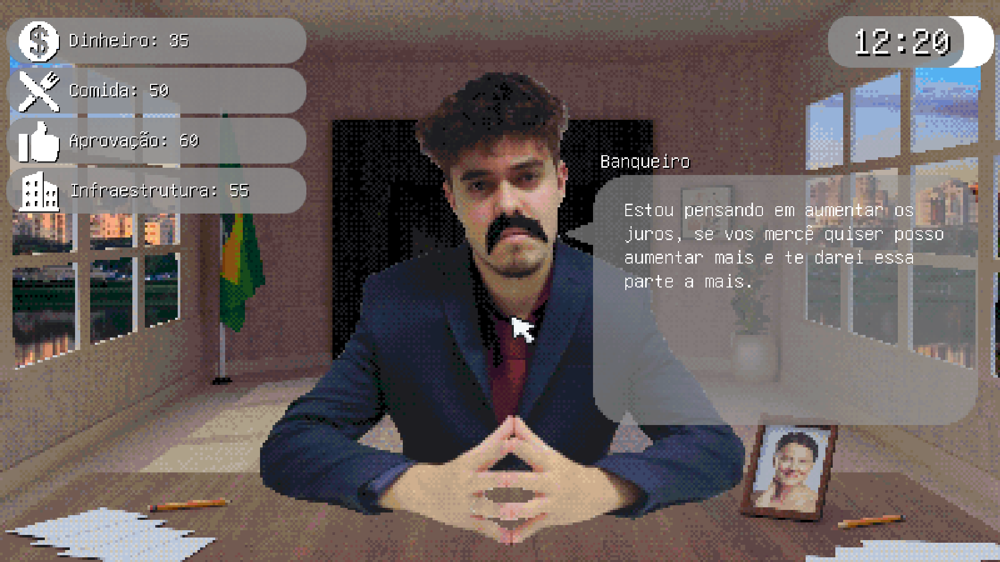
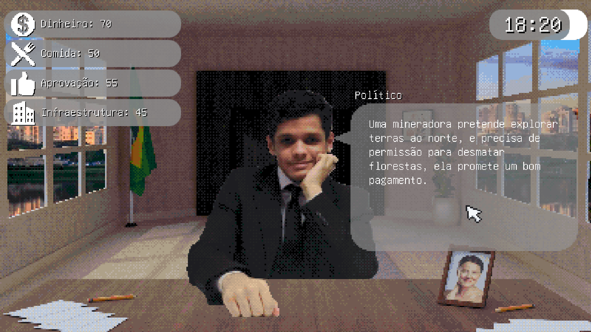
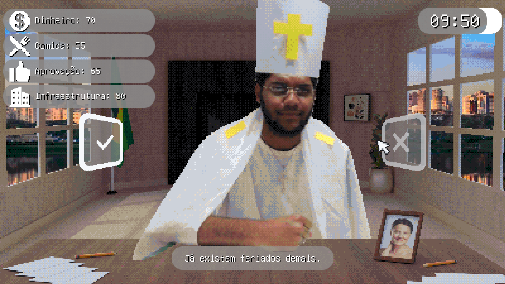
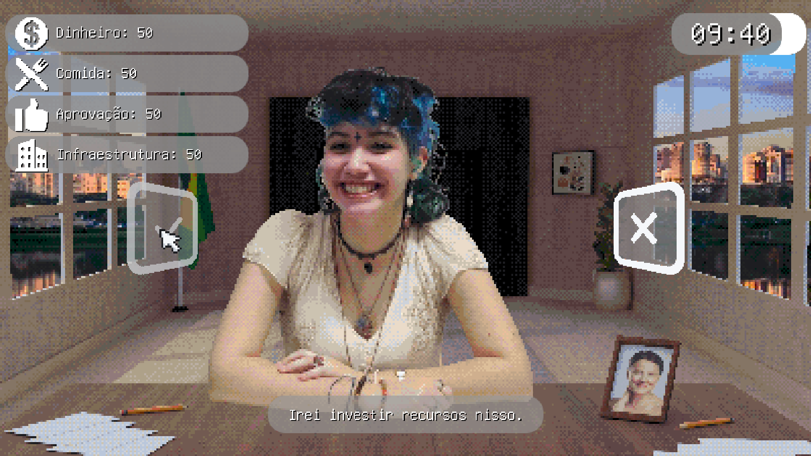

 

 

## GERAL

&#160;&#160;&#160;&#160;Jogo desenvolvido pela turma do **3º Ano do curso de Programação de Jogos Digitais de 2025** da ETEC PJ como projeto pra matéria de Sociologia. Ele foi feito com base na semana mídiatíca e foi apresentado ao público (Alunos da ETEC) no dia 31/10 de 2025, tendo tido uma recepção muito boa pelos que jogaram.

### O projeto foi feito em 1 mês, e recebeu nota máxima!

 

    

 

## GAMEPLAY

Você jogará durante 10 dias como o grande PRESIDENTE DA REPÚBLICA, e precisa tomar as decisões mais perspicases para manter sua nação de pé, ou, simplesmente falhar e a levar a RUÍNA!!!! Durante os dias, irám vir várias pessoas a sala precisidencial, fazendo propostas, basta o jogador decidir se aceitaram a proposta, ou não...

É um jogo de decisão, gerenciamento de recursos, e point-and-click

## COMO JOGAR

## COMO COMPILAR?

Você precisará primeiramente dar clone nesse repositório na sua márquina, e utilizar o Game Maker Studio 2 para abrir o yyp do projeto.